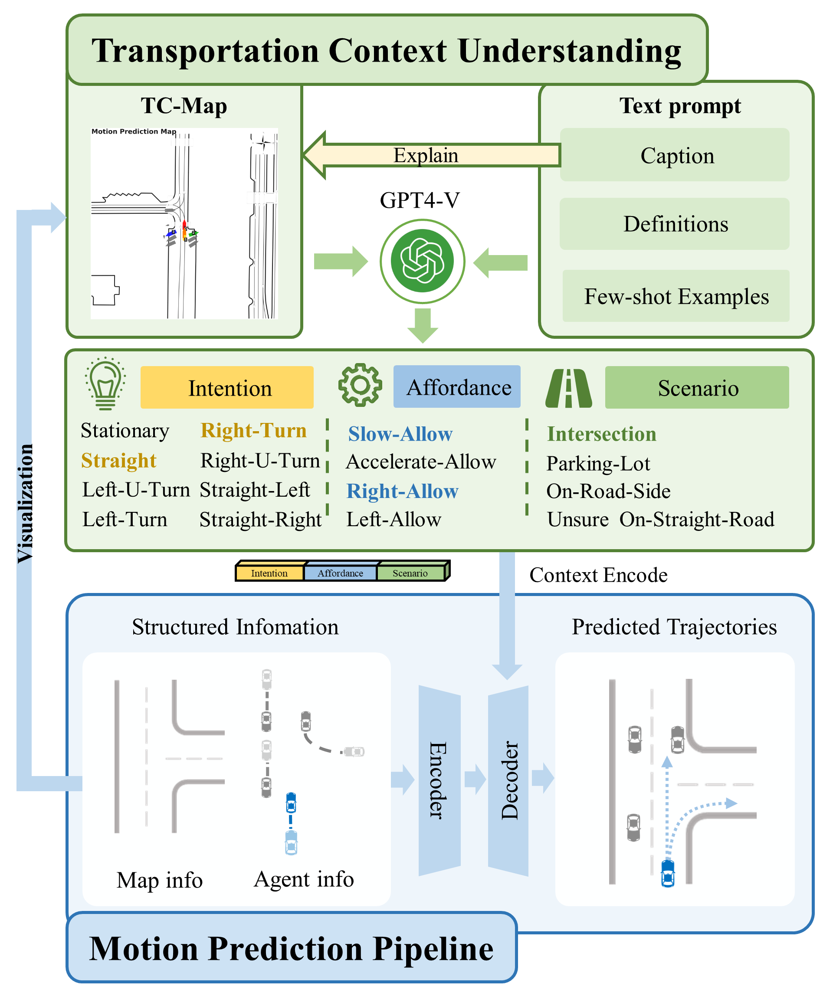
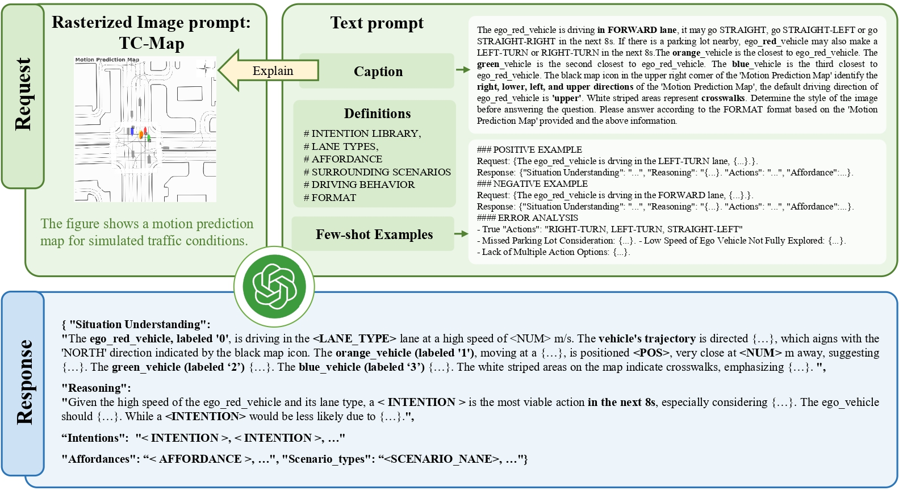
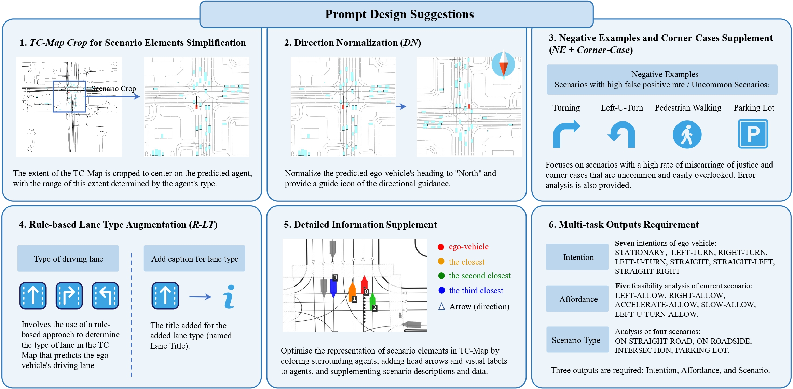

<h1 align="center">Large Language Models Powered Context-aware Motion Prediction</h1>
<p align="center">
    <a href="https://arxiv.org/abs/2403.11057"></a>
</p>

<h4 align="center">
    <a href="https://seu-zxj.github.io/">Xiaoji Zheng</a>,
    <a href="https://github.com/wuli-maker">Lixiu Wu</a>,
    <a href="https://github.com/BJHYZJ">Zhijie Yan</a>,
    <a href="https://arxiv.org/search/cs?searchtype=author&query=Tang,+Y">Yuanrong Tang</a>,
    <a href="https://sites.google.com/view/fromandto">Hao Zhao</a>,
    <a href="https://arxiv.org/search/cs?searchtype=author&query=Zhong,+C">Chen Zhong</a>,
    <a href="https://www.sigs.tsinghua.edu.cn/cbk/main.htm">Bokui Chen</a>,
    <a href="https://air.tsinghua.edu.cn/info/1046/1635.htm">Jiangtao Gong</a>
</h4>

https://github.com/SEU-zxj/LLM-Augmented-MTR/assets/73421144/f0cbbe14-1a9c-496b-87af-89ea78fff087

# Introduction

Motion prediction is among the most fundamental tasks in autonomous driving. Traditional methods of motion forecasting primarily encode vector information of maps and historical trajectory data of traffic participants, lacking a comprehensive understanding of overall traffic semantics, which in turn affects the performance of prediction tasks. In this paper, we utilized Large Language Models (LLMs) to enhance the global traffic context understanding for motion prediction tasks. We first conducted systematic prompt engineering, visualizing complex traffic environments and historical trajectory information of traffic participants into image prompts---Transportation Context Map (TC-Map), accompanied by corresponding text prompts. Through this approach, we obtained rich traffic context information from the LLM. By integrating this information into the motion prediction model, we demonstrate that such context can enhance the accuracy of motion predictions. Furthermore, considering the cost associated with LLMs, we propose a cost-effective deployment strategy: enhancing the accuracy of motion prediction tasks at scale with 0.7% LLM-augmented datasets. Our research offers valuable insights into enhancing the understanding of traffic scenes of LLMs and the motion prediction performance of autonomous driving.



# News
[2024/04/20] The LLM-Augmented-MTR part of our code was released.
[2024/03/17] Our paper are released on Arxiv, you can read it by clicking this [link](https://arxiv.org/abs/2403.11057).

# Repository Structure
```
LLM-Augmented-MTR
├─docs                                                 # Documentation of our work
│  ├─model_docs
│  └─prompt_docs
├─fig
├─llm_augmented_mtr                                    # MTR integrate with LLM's context data
│  ├─data                                              # stores WOMD dataset and cluster file for MTR
│  │  └─waymo
│  ├─LLM_integrate                                     # raw data of LLM, code to process LLM's output
│  │  ├─embedding                                      # defined file format of context data equipped with embedding
│  │  ├─LLM_output                                     # raw data of LLM and corresponding process program
│  │  │  └─raw_data
│  │  └─tools                                          # tools to assist data process (embedding generate and retrieval)
│  │      ├─cfgs                                       # configuation files
│  │      ├─generate_feature_vector_utils              # utility for embedding (feature vector) generation
│  │      └─scripts                                    # encapsulated scripts for users to run different tasks
│  ├─mtr                                               # MTR model from Shaoshuai Shi, and we do minor change to integrate it with LLM
│  │  ├─datasets                                       # defined data types and logic of dataloader
│  │  │  ├─llm_context                                 # format of context data provided by LLM
│  │  │  └─waymo                                       # data type used in project, and logic of dataloader
│  │  ├─models                                         # model structure of MTR
│  │  │  ├─context_encoder
│  │  │  ├─motion_decoder
│  │  │  └─utils
│  │  │      └─transformer
│  │  ├─ops                                            # CUDA code of attention to improve computing speed
│  │  │  ├─attention
│  │  │  │  └─src
│  │  │  └─knn                                         # CUDA code of K Nearest Neighbor
│  │  │      └─src
│  │  └─utils
│  ├─submit_to_waymo                                   # convert result data to submission version
│  └─tools                                             # tools to run programs (train/eval)
│      ├─cfgs                                          # configuration files
│      │  └─waymo
│      ├─eval_utils
│      ├─run                                           # encapsulated scripts for users to train/eval llm-augmented-mtr
│      ├─scripts
│      └─train_utils
└─llm_augmented_prompt                                 # Prompt engineering for LLM
```

# Prompt Engineering

we conducted a comprehensive prompt design and experiment and summarised six prompt suggestions for future researchers who want to utilize LLM's ability to understand BEV-liked complex transportation maps.





# Get Start

## LLM-Augmented Propmt


## LLM-Augmented MTR

- [Tutorial](https://github.com/SEU-zxj/LLM-Augmented-MTR/blob/main/docs/model_docs/README.md)
  - [Dataset Preparation](https://github.com/SEU-zxj/LLM-Augmented-MTR/blob/main/docs/model_docs/README.md#1-dataset-preparation)
  - [Install](https://github.com/SEU-zxj/LLM-Augmented-MTR/blob/main/docs/model_docs/README.md#2-install)
  - [Train and Eval](https://github.com/SEU-zxj/LLM-Augmented-MTR/blob/main/docs/model_docs/README.md#3-train-and-eval)
  - [Submit to WOMD LeaderBoard](https://github.com/SEU-zxj/LLM-Augmented-MTR/blob/main/docs/model_docs/README.md#4-submit-to-womd-leaderboard)
  - [More Details](https://github.com/SEU-zxj/LLM-Augmented-MTR/blob/main/docs/model_docs/README.md#5-more-details)

# Acknowledgement

This repository is based on the code from [Waymo Open Dataset](https://github.com/waymo-research/waymo-open-dataset), [MTR](https://github.com/sshaoshuai/MTR).
Thanks~

# Citation

if you find our work are useful, we are happy to hear you cite our work!

```latex
@misc{llm_augmented_mtr,
      title={Large Language Models Powered Context-aware Motion Prediction}, 
      author={Xiaoji Zheng and Lixiu Wu and Zhijie Yan and Yuanrong Tang and Hao Zhao and Chen Zhong and Bokui Chen and Jiangtao Gong},
      year={2024},
      eprint={2403.11057},
      archivePrefix={arXiv},
      primaryClass={cs.CV}
}
```
